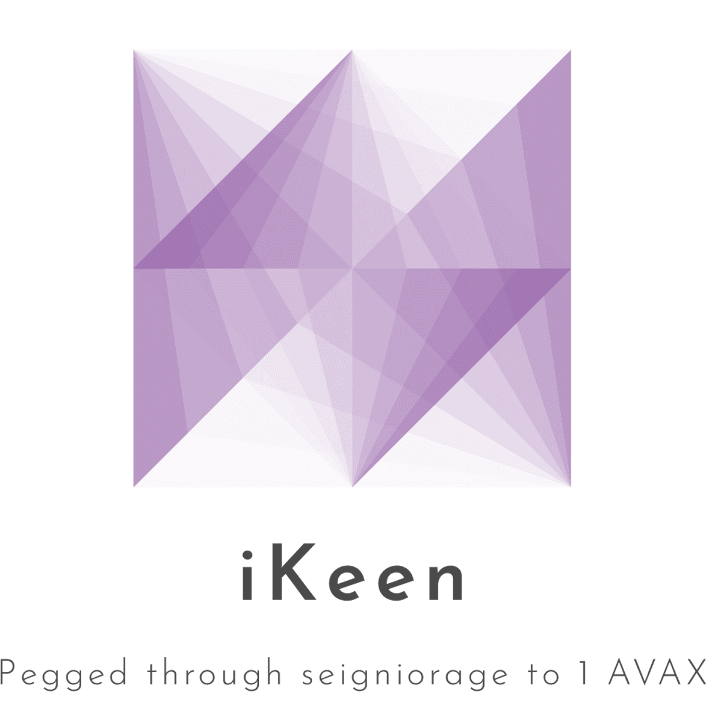

> iKeen is a DeFi protocol on the Avalanche C-Chain pegged through seigniorage to the value of 1 AVAX.

iKeen works by inflating the KEEN supply when above peg (1 KEEN > 1.01 AVAX) and selling bonds when lower than peg (1 KEEN < 1.01 AVAX) to long-term supporters of the protocol. iKeen ~~is~~ will be a fork of Tomb Finance, when we launch.

### Official Links

- Website - https://ikeenfi.app/ (upcoming)
- Twitter - https://twitter.com/iKeenfinance
- Discord - https://discord.gg/u6J9Qe2Wnq
- Blog - https://paper.wf/ikeen-finance
- Matrix - https://matrix.to/#/#ikeen-finance:matrix.org
