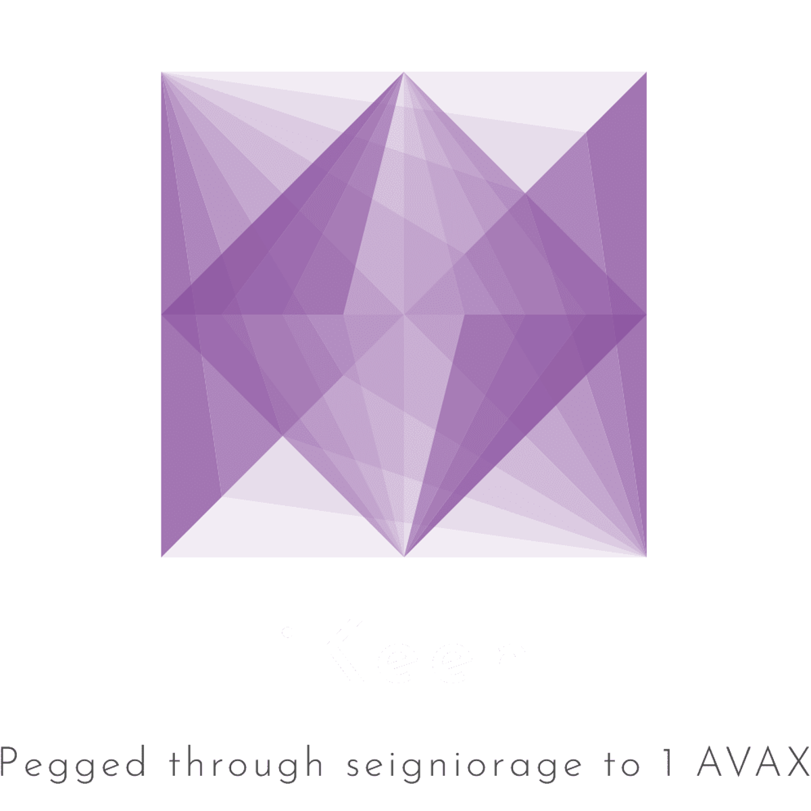

> iKeen is a DeFi protocol on the Avalanche C-Chain pegged through seigniorage to the value of 1 AVAX.

iKeen works by inflating the KEEN supply when above peg (1 KEEN > 1.01 AVAX) and selling bonds when lower than peg (1 KEEN < 1.01 AVAX) to incentivize a peg to 1 AVAX. iKeen is a fork of Bomb Money.

### Official Links

- Website - https://ikeenfi.app/
- Twitter - https://twitter.com/iKeenfinance
- Discord - https://discord.gg/u6J9Qe2Wnq
- Blog - https://paper.wf/ikeenfi
- Matrix - https://matrix.to/#/#ikeen-finance:matrix.org

# Big Disclaimer

Do your own research. There is a high risk of financial loss, either through normal price depreciation, smart contract hacks or other circumstances.
iKeen Finance is beta software, it can contain bugs. **By using iKeen Finance, you agree that the team are not responsible for any financial losses.**

Nothing here is financial advice. We do not operate or control the smart contracts, they are decentralized and open and so people can use them directly from the blockchain.
In using them you agree that you are complying with the laws of your jurisdiction.
